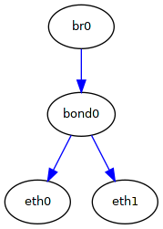

# ifupdown-ng

ifupdown-ng is a network device manager that is largely compatible with Debian
ifupdown, BusyBox ifupdown and Cumulus Networks' ifupdown2.

## Dependency Resolution

ifupdown-ng uses a dependency resolver to determine interface bring-up order
in a deterministic way.  To use this feature, you must declare relationships
between interfaces with the `requires` keyword.  This keeps the implementation
efficient.  For convenience, the `requires` keyword is exported to executors
as the `IF_REQUIRES` environment variable.

For compatibility with some legacy ifupdown executors, we also provide the
`requires` keyword under other environment variables in some cases.

## Caveats

* ifupdown2 python plugins are not supported at this time.  An executor could be
  written to handle them.

* ifupdown-ng retains compatibility with /etc/network/if-X.d scripts, but will
  prefer using executors in /usr/libexec/ifupdown-ng where appropriate.

This package is planned to replace BusyBox ifupdown in Alpine at some point in
the future.
